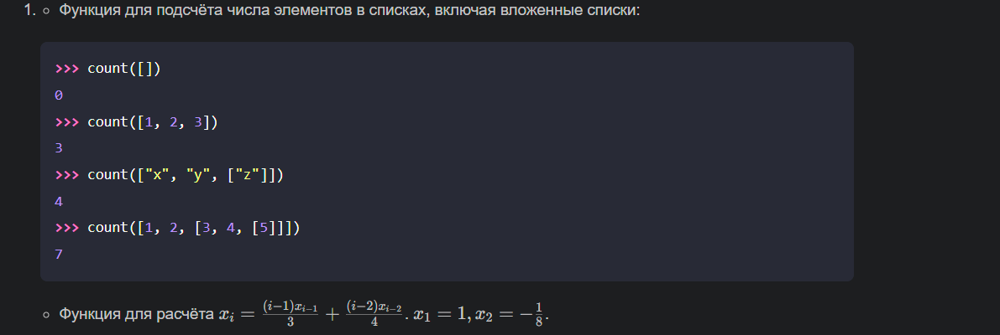
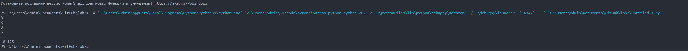

# lab 7

# Задание
    Сложность:
        Rare
            Напишите две функции для решения задач своего варианта - с использованием рекурсии и без.
            Оформите отчёт в README.md. Отчёт должен содержать:
            Условия задач
            Описание проделанной работы
            Скриншоты результатов
            Ссылки на используемые материалы

# Вариант №1


# Ход работы
# Программное решение 1 С РЕКУРСИЕЙ
```python
#Функция для подсчета числа элементов в списках:
def count(lst):
    if not lst:
        return 0
    if isinstance(lst, list):
        return count(lst[0]) + count(lst[1:])
    return 1
#Функция для расчета xi:
def calculate_xi(n):
    if n == 1:
        return 1
    if n == 2:
        return -1 / 8
    return ((n - 1) * calculate_xi(n - 1)) / 3 + ((n - 2) * calculate_xi(n - 2)) / 4
print(count([]))
print(count([1, 2, 3]))
print(count(["x", "y", ["z"]]))
print(count([1, 2, [3, 4, [5]]]))
print(calculate_xi(1))
print(calculate_xi(2))

```
# Программное решение 2 БЕЗ РЕКУРСИИ
```python
def count(lst):
    stack = [lst]
    count = 0
    while stack:
        current = stack.pop()
        if isinstance(current, list):
            stack.extend(current)
        else:
            count += 1
    return count

def calculate_xi(n):
    if n == 1:
        return 1
    if n == 2:
        return -1 / 8
    xi_minus_1 = 1
    xi_minus_2 = -1 / 8
    xi = 0
    for i in range(3, n+1):
        xi = ((i - 1) * xi_minus_1) / 3 + ((i - 2) * xi_minus_2) / 4
        xi_minus_2 = xi_minus_1
        xi_minus_1 = xi
    return xi

print(count([]))
print(count([1, 2, 3]))
print(count(["x", "y", ["z"]]))
print(count([1, 2, [3, 4, [5]]]))
print(calculate_xi(1))
print(calculate_xi(2))

```
# Результат  


# Список использованных источников
1. https://habr.com/ru/articles/275813/